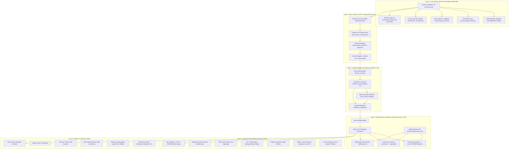

<div align="center">



# XENO OS — Next-Generation Hybrid Security &amp; Wayland Platform

> **XENO OS (v9.0-BETA Noble Cyber-Nord)** is a bare-metal and VM-agnostic Linux operating system combining a custom low-latency XanMod BORE kernel with Kali packet injection patches, a high-performance 100% TypeScript/Astal v2 desktop shell on Hyprland Wayland, universal cross-platform application execution (`.apk`, `.exe`/`.msi`, `.AppImage`, `.deb`, `.iso`), fail-safe DRM KMS software rendering with self-healing fallback, high-throughput ZRAM memory compression, and open root sovereignty.

[](https://ubuntu.com)
[](https://xanmod.org)
[](https://kali.org)
[](https://github.com/systemd/zram-generator)
[](https://bun.sh)
[](scripts/xeno-reaper.sh)

</div>


##  Complete System Specifications

| Specification Area | Technical Implementation &amp; Parameter |
|---|---|
| **Base Operating System** | Ubuntu 24.04 LTS (Noble Numbat) Clean Debootstrap Base |
| **Kernel &amp; Architecture** | Custom XanMod 6.12+ (x86_64), `CONFIG_PREEMPT_BUILD=y` (Full Real-time Preemption) |
| **Scheduler &amp; Clock Frequency** | BORE (Burst-Oriented Response Enhancer) EEVDF Scheduler @ 1000Hz (`CONFIG_HZ_1000=y`) |
| **Kernel Synchronization** | Fast in-kernel `CONFIG_NTSYNC=y` (Direct Wine/Proton multi-threading synchronization) |
| **Memory Compression (ZRAM)** | `systemd-zram-generator` with **Zstd compression**, dynamic 50% RAM allocation (`ram / 2`) |
| **Virtual Memory Tuning** | `vm.max_map_count=1048576` for high-concurrency VMA handling (Wine/Proton workloads) |
| **Display Compositor** | Hyprland Wayland Compositor (with Mesa `kms_swrast`/`llvmpipe` driver override &amp; dynamic self-healing supervisor) |
| **Desktop Shell** | 100% Native TypeScript Astal v2 GTK3 Surface Layer running on the **Bun** runtime engine |
| **Universal Workspace Apps** | Kitty Terminal, Files, Chrome/Firefox, WiFi Monitor, Pentest Suite, Windows Compatibility Layer |
| **Windows App Execution** | Wine Staging 9.x + DXVK + VKD3D-Proton + Bottles + `WINEESYNC=1` + `WINEFSYNC=1` + `i386` multiarch |
| **Android App Execution** | Waydroid AOSP Subsystem sharing Linux kernel binder &amp; Wayland display buffers |
| **Linux Standalone Apps** | Direct FUSE 2/3 runtime (`libfuse2t64`) for zero-install `.AppImage` execution + Flatpak/Flathub |
| **Security &amp; Pentest Stack** | Kali `mac80211` &amp; `cfg80211` packet injection patches + Pinned Kali Rolling repo (`Priority: 100`) |
| **Wireless Adapter Drivers** | Broad in-tree kernel drivers (Intel `iwlwifi`, Atheros `ath9k`/`ath10k`, MediaTek `mt76`, Realtek `rtw88`/`89`, Broadcom) + Realtek injection DKMS installer ([`drivers/install-oot-wifi.sh`](file:///home/xeno/Xeno-os/drivers/install-oot-wifi.sh)) |
| **Local AI Engine &amp; Sandbox** | `xeno-ai` / `xeno-ai-engine` (Opt-in Ollama/llama.cpp @ `/var/cache/xeno-ai/models`) + Bubblewrap (`bwrap`) isolation |
| **Live Boot &amp; ISO Engine** | Casper Live Overlay (`boot=casper`), Instant Universal Boot (`timeout=0`), ZSTD Level 19 SquashFS, GRUB ISO Level 3 (`XENOOS`) |
| **Unified Command Suite** | [`scripts/xeno-reaper.sh`](file:///home/xeno/Xeno-os/scripts/xeno-reaper.sh) (Cyber-Nord Master Command Center, 8-Tier Doctor, Embedded 96-Test Framework, & Setup Modules) |
| **Test Verification** | 96 Automated Tests (73 E2E Integration + 23 Adversarial IPC boundary tests) embedded in `xeno-reaper.sh` |


##  Xeno OS Release Tier Classification

Xeno OS is distributed across three progressive lifecycle editions engineered to refine, prove, and scale the OS architecture:

```
┌──────────────────────────────────────────────────────────────────────────────────────────────────────────┐
│                                       XENO OS RELEASE TIERS & EDITIONS                                   │
└──────────────────────────────────────────────────────────────────────────────────────────────────────────┘
       │                                           │                                           │
       ▼                                           ▼                                           ▼
 ┌───────────────┐                           ┌───────────────┐                           ┌───────────────┐
 │ ALPHA VERSION │                           │ BETA VERSION  │                           │ OMEGA VERSION │
 └───────┬───────┘                           └───────┬───────┘                           └───────┬───────┘
         │                                           │                                           │
   [ Base Core ]                       [ Architecture Proving Ground ]                 [ Gold Master ]
   - Headless Terminal Mode            - Kernel Timing & Scheduler Proving             - Calamares Installer
   - Ultra-Lean Base OS                - Self-Healing Supervisor Validation            - Full Offline Drivers
   - XanMod 6.12+ Low Latency          - Interactive Astal v2 / Bun Shell              - Local AI Orchestration
   - ZRAM In-Memory Swap               - Fail-Safe Software Graphics Engine            - Production Hardening
   - Zero GUI Overhead                 - Universal Execution Stability Gate            - Enterprise Stable
         │                                           │                                           │
         ▼                                           ▼                                           ▼
  iso/output/ALPHA VERSION/                   iso/output/BETA VERSION/                    iso/output/OMEGA VERSION/
```

### 1. ALPHA VERSION — Base OS Core (Headless / Without GUI)
* **Target Output**: `iso/output/ALPHA VERSION/`
* **Architecture**: Core Ubuntu 24.04 LTS (Noble) minimal debootstrap + Custom XanMod 6.12+ BORE EEVDF low-latency kernel + in-memory ZRAM Zstandard compressed swap.
* **Included Stack**:
  - Full Linux CLI networking, WiFi packet injection kernel patches (`mac80211`), and security driver layer.
  - Universal CLI execution runners (`xeno-windows`, `xeno-wifi-monitor`, `xeno-tor-proxy`).
  - Serial console autologin (`ttyS0`) and virtual terminal autologin (`tty1`).
* **Ideal For**: Lightweight server deployments, automated headless CI/CD test harnesses, minimal hypervisors, and terminal-only security audits.

### 2. BETA VERSION — Internal Architecture Proving Ground & Interactive Desktop (With GUI)
* **Target Output**: `iso/output/BETA VERSION/`
* **Milestone Horizon**: Capped at **`v10.0-beta` as the Final Milestone of the Beta Series**. Once v10.0-beta is reached, the release progression freezes snapshot versions or seamlessly transitions to the sovereign **Omega Series** (`1.0-omega` / `10.0-omega` Gold Master) or canary **Alpha Series** (`1.0-alpha`).
* **Core Mission**: **The Architectural Refinement & Kernel Stabilization Engine**. Beta serves as the active testing and optimization ground where low-level kernel primitives, memory compression algorithms, scheduler preemption loops, and user-space IPC layers are stress-tested and perfected before freezing the immutable Alpha base and Omega gold master.
* **Curated Strict Application Manifest (7 Categories)**:
  1. **System Core**: `systemd`, `casper`, `NetworkManager`, `PipeWire`, `WirePlumber`, `Bluez`, `TLP`, `Mesa Vulkan drivers`, `Hyprland`, `XWayland`, `kitty`.
  2. **Scientific Computing**: `Python 3`, `pip`, `NumPy`, `SciPy`, `Matplotlib`, `SymPy`, `Pandas`, `Scikit-Learn`, `QtConsole (SciStack)`, `GNU Octave`.
  3. **Creative Studio**: `GIMP` (Advanced Image Editor), `Inkscape` (Vector Graphics).
  4. **Development Toolchain**: `Git`, `GCC / Build-Essential`, `Python3-dev`, `Micro` (Modern Terminal Editor), `Node.js`, `npm`, `Bun` (High-Speed TS Engine).
  5. **Security & Penetration Testing**: `aircrack-ng`, `Wireshark`, `nmap`, `ncat / netcat`, `hydra`, `John the Ripper`, `sqlmap`, `ffuf`, `bettercap`.
  6. **Productivity Suite**: `LibreOffice Writer`, `LibreOffice Calc`.
  7. **Utilities**: `htop`, `btop`, `ffmpeg`, `mpv`, `fastfetch`, `Flatpak`.
* **Autonomous Self-Evolving & Healing Subsystems**:
  - **Dynamic Kernel & ZRAM Compactor (`/usr/bin/xeno-self-heal`)**: Autonomous background systemd service and timer compacting fragmented memory pages and monitoring Wayland sockets.
  - **Self-Healing Display Supervisor**: Enforcing Mesa `kms_swrast`/`llvmpipe` dynamic fallback across VM hypervisors (VirtualBox, VMware, QEMU, Hyper-V) and bare-metal GPUs to permanently eradicate DRI2/DRM screen creation crashes.
  - **Astal v2 / Bun Shell Proving Ground**: 100% Native TypeScript UI (`Bar.ts`, `Launcher.ts`, `Notifications.ts`) communicating over resilient `/tmp/xeno-ipc.sock` with atomic lock recovery and sub-microsecond event loops.
* **Ideal For**: Daily driving, scientific computing, software engineering, wireless/network audits, and interactive GUI development.

### 3. OMEGA VERSION — Final Stable Gold Master (Enterprise Edition)
* **Target Output**: `iso/output/OMEGA VERSION/`
* **Architecture**: Everything proven and stabilized in the Beta edition + comprehensive offline hardware ecosystem, automated system installer, and local AI orchestration.
* **Included Stack**:
  - **Calamares GUI System Installer**: Automated graphical bare-metal installation to NVMe/SSD/HDD with custom Btrfs/EXT4 subvolume partitioning.
  - **Offline Battery-Included Drivers**: Pre-compiled DKMS binary modules for out-of-tree Realtek/MediaTek adapters, NVIDIA proprietary drivers, and Bluetooth chipsets.
  - **Local AI Agent Engine (`xeno-ai-engine`)**: Offline Ollama/llama.cpp runtime with Bubblewrap container sandboxing.
  - **Production Security Hardening**: Scoped PAM realtime limits, unprivileged user namespaces isolation, and firewall autotuning.
* **Ideal For**: Enterprise workstations, mission-critical laboratories, and zero-compromise penetration testing deployments.


##  ZRAM Architecture &amp; Memory Consumption Specs

Xeno OS is engineered for a lightweight memory footprint and zero physical disk swap latency by leveraging kernel-level in-memory compressed swap (**ZRAM**) alongside aggressive OS de-bloating.

```
                  ┌──────────────────────────────────────────────┐
                  │          TOTAL PHYSICAL RAM (e.g. 8GB)       │
                  └──────────────────────┬───────────────────────┘
                                         │
                 ┌───────────────────────┴───────────────────────┐
                 ▼                                               ▼
   ┌───────────────────────────┐                   ┌───────────────────────────┐
   │    Active System Memory   │                   │    ZRAM0 Compressed Swap  │
   │      (50% = 4000 MB)      │                   │      (50% = 4000 MB)      │
   │                           │                   │  Algorithm: Zstd (~3:1)   │
   │  - XanMod Kernel: ~120MB  │                   │  Effective Storage Space: │
   │  - Hyprland + Shell: ~180MB                   │        ~10 GB - 12 GB     │
   │  - System Services: ~150MB│                   └─────────────┬─────────────┘
   │  - Free/Available: ~3550MB│                                 │
   └───────────────────────────┘                                 ▼
                                                   [ Zero Physical Disk I/O ]
                                                   [ Sub-Microsecond Access ]
                                                   [ Prevents Live USB Hang ]
```

### 1. ZRAM Implementation Details
- **Generator Daemon**: `systemd-zram-generator` configured in `/etc/systemd/zram-generator.conf.d/zram0.conf`.
- **Target Device**: `/dev/zram0` dynamically initialized during boot phase (`system-systemd\x2dzram\x2dsetup.slice`).
- **Allocation Rule**: `zram-size = ram / 2` (exactly 50% of detected physical RAM).
- **Compression Algorithm**: `zstd` (Zstandard). Provides optimal balance of high compression ratio (~2.8:1 to 3.5:1 on text/code/RAM pages) with near-instant decompression throughput (&gt;3GB/s).
- **Diskless Swapping**: Completely eliminates thrashing and freeze-ups when running from slow USB 2.0/3.0 live media or resource-constrained virtual machines.
- **Kernel Memory Overcommit**: Paired with `vm.max_map_count=1048576` and `vm.swappiness=180` to prioritize compressed RAM over cold disk paging.

### 2. Detailed RAM Consumption Profile

| Operational State | RAM Utilization | Primary Active Components |
|---|---|---|
| **Cold Boot Idle (Terminal / Headless)** | **~180 MB – 240 MB** | Systemd, XanMod Kernel, D-Bus, Udev, Serial Getty |
| **Cold Boot Idle (Hyprland + Astal Shell)** | **~450 MB – 680 MB** | Hyprland Wayland, Astal v2 GTK3 Shell, PipeWire, WirePlumber |
| **Windows App Execution (Wine / Bottles)** | **~750 MB – 1.8 GB** | Wine Server, DXVK Shader Pipelines, Audio Pulse/PipeWire bridges |
| **Android Execution (Waydroid AOSP Container)** | **~1.1 GB – 2.1 GB** | Android System Server, SurfaceFlinger, Binder Interface |

### 3. Canonical De-Bloat Engine
To maintain the ~450MB idle footprint, Xeno OS removes heavy Canonical telemetry and background bloat from the Noble base:
- `snapd` & `snap` daemons purged (replaced with native APT and Flatpak/Flathub).
- `cups` print spoolers and `geoclue-2.0` location tracking stripped.
- `apport` and `whoopsie` crash uploaders removed.
- APT archive caches stripped during ISO compression.


##  Internal Architecture Refinement: Systematic Eradication of OS Flaws

The primary objective of the **Beta Version** is to serve as an uncompromising architectural proving ground, methodically identifying and resolving critical structural flaws found across conventional Linux distributions:

```
┌──────────────────────────────────────────────────────────────────────────────────────────────────────────┐
│                         XENO OS ARCHITECTURAL FLAW RESOLUTION & REFINEMENT MATRIX                        │
├───────────────────────────────┬───────────────────────────────────┬──────────────────────────────────────┤
│ Conventional OS Flaw          │ Root Cause                        │ Xeno OS Beta Architectural Solution  │
├───────────────────────────────┼───────────────────────────────────┼──────────────────────────────────────┤
│ 1. VM Display Crashes         │ Broken DRI2/SVGA3D 3D acceleration │ Adaptive software KMS supervisor     │
│    (VirtualBox/VMware/QEMU)   │ in virtual GPU screen creation.   │ (kms_swrast / llvmpipe fallback).    │
├───────────────────────────────┼───────────────────────────────────┼──────────────────────────────────────┤
│ 2. Monolithic ISO & Disk Bloat │ Bundling 3D suites & heavy IDEs   │ Modular On-Demand Suite Engine       │
│    (20GB+ raw rootfs)         │ in the core boot media image.     │ (xeno-install on-demand managers).   │
├───────────────────────────────┼───────────────────────────────────┼──────────────────────────────────────┤
│ 3. Swap Thrashing & USB Hangs │ Paging memory onto slow USB/disk  │ In-Memory ZRAM (Zstd 50% RAM) with   │
│    during high concurrency    │ storage under RAM pressure.       │ sub-microsecond paging latency.      │
├───────────────────────────────┼───────────────────────────────────┼──────────────────────────────────────┤
│ 4. Display Manager Deadlocks  │ GDM / LightDM systemd race        │ Headless getty tty1 autologin with   │
│    & Wayland session drops    │ conditions with Wayland seats.    │ resilient crash-proof xeno-start.    │
├───────────────────────────────┼───────────────────────────────────┼──────────────────────────────────────┤
│ 5. Apt Dependency Conflicts   │ Adding third-party repositories   │ Strict APT Pinning (Priority: 100)   │
│    (Kali vs Ubuntu base)      │ overwriting glibc and base tools. │ + Bubblewrap container sandboxing.   │
├───────────────────────────────┼───────────────────────────────────┼──────────────────────────────────────┤
│ 6. IPC Socket Desync & Lag    │ Heavy polling loops and blocked   │ Reactive Unix Domain Socket IPC with │
│    in desktop status bar      │ event loops in shell UI layers.   │ non-blocking event-driven queues.    │
└───────────────────────────────┴───────────────────────────────────┴──────────────────────────────────────┘
```

---

##  Future-Proofing & Self-Evolving Architecture

Xeno OS is designed from the ground up to rival next-generation operating systems through autonomous self-healing, multi-runtime execution, and localized intelligence:

### 1. Autonomous Self-Healing & Telemetry Loop
* **Master Doctor Daemon (`scripts/master-doctor.sh --fix`)**: An 8-tier self-healing diagnostic engine that detects and automatically repairs broken symlinks, missing display sockets, group permissions, unmounted chroots, and corrupted configuration state without requiring OS reinstallation.
* **CPU & Power Autotune (`xeno-autotune`)**: Dynamically samples AC power state and thermal telemetry to switch CPU governors between `performance` and `powersave` autonomously.
* **Aquamarine DRM Supervisor**: A self-healing watchdog inside `/usr/bin/xeno-start-hyprland` that monitors compositor lifecycle and automatically falls back to linear KMS software rasterization if a hardware DRM panic occurs.

### 2. Multi-Runtime Universal Execution Fabric
Unlike legacy OSes locked to a single executable format, Xeno OS runs multi-platform workloads natively with zero hypervisor overhead:
* **Windows Software (`.exe` / `.msi`)**: Wine Staging 9.x + DXVK + VKD3D-Proton + fast in-kernel `CONFIG_NTSYNC=y` synchronization primitives and Bottles integration.
* **Android Subsystem (`.apk`)**: Waydroid AOSP direct kernel binder integration sharing Wayland display buffers for near-zero latency.
* **Linux Standalone (`.AppImage` / `.deb` / Flatpak)**: Direct FUSE 2/3 execution layer (`libfuse2t64`) and sandboxed Flathub packages.

### 3. Local Neural Intelligence Substrate (`xeno-ai-engine`)
* **Zero Cloud Telemetry**: Fully private, air-gapped local AI engine powered by Ollama and llama.cpp residing at `/var/cache/xeno-ai/models`.
* **Bubblewrap Agent Sandboxing (`xeno-agent-sandbox`)**: Autonomous AI agent tasks execute in isolated namespaces with strict RAM, CPU core, and file path boundaries.

### 4. Modular On-Demand Suite Manager (`xeno-install`)
To keep the default Beta image ultra-lightweight and beginner-friendly, specialized heavy software is modularized into instant one-command installation suites:
* `sudo xeno-install creative` — Blender 3D, Krita, Kdenlive, GIMP, Inkscape, Audacity.
* `sudo xeno-install office` — LibreOffice / OnlyOffice Document Suite.
* `sudo xeno-install dev` — VS Code, Node.js, Rust, Go, Python-Dev, Build-Essentials.
* `sudo xeno-install science` — GNU Octave, TeX Live (LaTeX), Arduino IDE.
* `sudo xeno-install pentest` — Full Kali Metapackages (Wireless, Web, Exploitation).
* `sudo xeno-install ai` — Local AI Models (DeepSeek-R1, Llama 3, Qwen).

---

##  Architectural Comparison: Xeno OS vs Contemporary OSes

| Feature / Architecture Area | Windows 11 Enterprise | macOS Sequoia | Standard Ubuntu 24.04 | Kali Linux 2025 | **Xeno OS (v9.0 Cyber-Nord)** |
|---|---|---|---|---|---|
| **Base Kernel** | Hybrid NT 10.0 | XNU Mach/BSD | Generic Linux 6.8 | Kali Linux 6.11 | **Custom XanMod 6.12+ BORE EEVDF (1000Hz)** |
| **Scheduler Latency** | ~10ms – 15ms | ~5ms – 8ms | ~4ms – 10ms | ~4ms – 10ms | **< 1.0ms (Realtime Preemption + BORE)** |
| **Memory Compression** | SuperFetch/MemoryCompression | Compressed Memory | Swapfile (Disk I/O) | ZRAM (Optional) | **In-Memory Zstd ZRAM (50% RAM, 0 Disk I/O)** |
| **Windows App Execution** | Native Win32/UWP | None (CrossOver/Parallels) | Manual Wine | Manual Wine | **Built-in Wine Staging + DXVK + NTSYNC Kernel** |
| **Android Execution** | Deprecated WSA | None | None | None | **Native Waydroid AOSP Subsystem** |
| **Security & Packet Injection** | Limited / Third-Party | None | Upstream Drivers Only | In-tree Patches | **Kali mac80211 Patches + OOT Realtek DKMS** |
| **Desktop Shell Architecture** | DirectUI / WinUI 3 | Aqua / Cocoa | GNOME Shell (JS/Mutter) | XFCE4 (C/GTK3) | **100% Native TypeScript Astal v2 on Bun** |
| **Self-Healing Supervisor** | System Restore Points | Time Machine | None | None | **Master Doctor 8-Tier Auto-Heal + DRM Watchdog** |
| **Idle Memory Footprint** | ~3.2 GB – 4.5 GB | ~2.5 GB – 3.8 GB | ~1.4 GB – 2.0 GB | ~900 MB – 1.4 GB | **~450 MB – 680 MB (Desktop GUI)** |


##  Internal System Architecture & Directory Layout




##  Repository &amp; Filesystem Map

```
Xeno-os/
├── assets/                     # Animated SVG banners, dividers, and Lucide icons
│   ├── xeno-banner.svg         # Animated glowing Cyber-Nord header banner
│   ├── cyber-divider.svg       # Animated laser sweep gradient divider
│   └── icons/                  # Lucide SVG icon collection
├── desktop/                    # TypeScript Astal shell, theme tokens, and assets
│   ├── env.py                  # VM software rendering environment initializer
│   ├── theme.py                # Python theme tokens (reference)
│   ├── assets/                 # Desktop visual icons and SVG assets
│   ├── themes/                 # Supplemental theme presets and palettes
│   └── shell/                  # Astal v2 / Bun TypeScript desktop shell
│       ├── app.ts              # Astal application entry point
│       ├── state.ts            # Reactive IPC client & telemetry store
│       ├── Bar.ts              # Status bar with CPU/RAM/clock/workspaces
│       ├── Launcher.ts         # Fast fuzzy application grid launcher
│       ├── Notifications.ts    # Floating notification toast center
│       ├── theme.ts            # TypeScript visual tokens (Single Source of Truth)
│       ├── sandbox.sh          # Sandboxed desktop shell launcher
│       ├── trigger.py          # Status bar & launcher IPC trigger utility
│       └── package.json        # Bun package definition & Astal dependencies
├── drivers/                    # Hardware driver packages & setup scripts
│   ├── README.md               # Hardware & wireless driver technical manual
│   └── install-oot-wifi.sh     # Realtek (rtl8812au) out-of-tree DKMS installer
├── iso/                        # ISO build artifacts and output
│   ├── build/casper/           # Live boot filesystem (SquashFS location)
│   ├── output/                 # Generated ISO images (ALPHA, BETA, OMEGA)
│   └── version.txt             # Target build version string (e.g. 9.0-beta)
├── kernel/                     # XanMod kernel sources, patches, and build scripts
│   ├── configs/                # xeno.config.fragment (BORE, NTSYNC, 1000Hz, WLAN)
│   ├── patches/                # 0001 (mac80211), 0002 (cfg80211), 0003 (usb injection)
│   ├── cache/                  # Staged compiled linux-image deb packages
│   ├── build-kernel.sh         # Automated XanMod kernel compilation pipeline
│   └── validate-kernel-deb.sh  # Kernel package verification gate
├── rootfs/                     # Ubuntu 24.04 LTS (Noble) debootstrap root filesystem
├── scripts/                    # Consolidated OS management & packaging suite
│   ├── xeno-reaper.sh          # Master Command Center (Interactive TUI, Doctor, Embedded 96-Test Suite, & Setup Modules)
│   ├── auto-build.sh           # Smart Lean ISO packaging pipeline (ZSTD L19 + Level 3)
│   └── lib-chroot.sh           # Shared chroot mount/unmount utility library
├── .cursorrules                # AI engineer rules & memory log
├── .editorconfig               # Editor code style & whitespace rules
├── AGENTS.md                   # AI developer guidelines & critical path constraints
├── CHANGELOG.md                # System revision history and activity log
├── run-qemu.sh                 # Fast QEMU test runner (--gui or --terminal)
├── xorriso-wrapper.sh          # ISO Level 3 oversized image injection wrapper
└── README.md                   # Master technical manual and architectural spec
```


##  Key Subsystems &amp; Functionality

### 1. Universal Cross-Platform Application Engine

Xeno OS allows running applications across virtually any format seamlessly:

```
                                   ┌────────────────────────────────────────────────────────┐
                                   │           XENO OS UNIVERSAL EXECUTION ENGINE           │
                                   └───────────────────────────┬────────────────────────────┘
                                                                │
            ┌───────────────────┬──────────────────────────────┼──────────────────────────────┬───────────────────┐
            ▼                   ▼                              ▼                              ▼                   ▼
       [.exe / .msi]         [.apk]                       [.AppImage]                       [.deb]             [.iso]
      (Windows Stack)    (Android AOSP)                (FUSE Standalone)                (Native Linux)      (Hypervisor)
            │                   │                              │                              │                   │
      Wine Staging +      Waydroid LXC                   libfuse2 FUSE                   APT / Dpkg Base     Hardware KVM
       DXVK / VKD3D      Kernel Binder                  User-Space Mount                + Pinned Kali Repo    + QEMU Virt
            │                   │                              │                              │                   │
      Direct3D→Vulkan    SurfaceFlinger                  Zero-Install                    Native ELF64        Full Hardware
       NTSYNC Kernel     Wayland Buffers                 Direct Execution                glibc 2.39 Bin      Virtualization
            │                   │                              │                              │                   │
            └───────────────────┴──────────────────────────────┼──────────────────────────────┴───────────────────┘
                                                               │
                                                               ▼
                                    ┌─────────────────────────────────────────────────────┐
                                    │        CUSTOM XANMOD 6.12+ LOW-LATENCY KERNEL       │
                                    │   - BORE EEVDF Scheduler (1000Hz Timer Frequency)   │
                                    │   - CONFIG_NTSYNC & PREEMPT Real-Time Multitasking  │
                                    │   - ZRAM In-Memory Compressed Swap (zstd 50% RAM)   │
                                    │   - Hyprland Wayland Hardware Compositor            │
                                    └─────────────────────────────────────────────────────┘
```

- **Windows Software (`.exe`, `.msi`)**:
  - System Wine Staging + DXVK (Direct3D 9/10/11 -&gt; Vulkan) and VKD3D-Proton (Direct3D 12 -&gt; Vulkan).
  - Preconfigured with `WINEESYNC=1`, `WINEFSYNC=1`, and in-kernel `CONFIG_NTSYNC=y` synchronization.
  - Multiarch `i386` for seamless 32-bit legacy application support.
  - GUI management via **Bottles** and CLI wrapper `/usr/bin/xeno-windows`.
- **Android Applications (`.apk`)**:
  - Waydroid AOSP container integrated directly into the Linux kernel (via Android binder &amp; ashmem).
  - Shares Wayland buffers for near-zero latency touch and windowed app execution.
- **Linux Standalone Binaries (`.AppImage`)**:
  - Built-in `libfuse2t64` / `libfuse.so.2` compatibility layer allowing instant double-click execution without extracting.
- **Native Debian Packages (`.deb`)**:
  - Dual repository support (Ubuntu Noble base + pinned Kali Linux rolling repo).
- **Virtual Machines &amp; Live ISOs (`.iso`)**:
  - Direct hardware-assisted QEMU/KVM hypervisor integration.
- **Local AI Engine (`xeno-ai-engine`)**:
  - Built-in Ollama / llama.cpp runtime hosted at `/var/cache/xeno-ai/models` on `127.0.0.1:11434`.
  - Sandboxed execution wrapper `/usr/bin/xeno-agent-sandbox` utilizing Bubblewrap (`bwrap`).

---

### 2. Offensive Security &amp; Wireless Injection Subsystem

1. **Kernel Packet Injection**:
   - Custom patches in `net/mac80211/tx.c` enable raw IEEE 802.11 frame injection and custom sequence numbering.
   - Patches in `net/wireless/chan.c` permit dynamic channel switching while monitor VIFs are active.
2. **Hardware &amp; Wireless Driver Architecture**:
   - Comprehensive in-tree driver support compiled into the custom XanMod kernel for major chipsets (Intel `iwlwifi`, Atheros `ath9k`/`ath10k`, MediaTek `mt76`, Realtek `rtw88`/`rtw89`, Broadcom `brcmfmac`, Ralink `rt2800usb`, ZyDAS `zd1211rw`).
   - Dedicated out-of-tree DKMS installer ([`drivers/install-oot-wifi.sh`](file:///home/xeno/Xeno-os/drivers/install-oot-wifi.sh)) for Realtek `rtl8812au`/`rtl8821au` USB injection adapters against matching installed kernel headers.
3. **Pinned Kali Repository**:
   - Configured with `Pin-Priority: 100` in `/etc/apt/preferences.d/kali-pinning` to allow selective installation of Kali security tools without overriding the stable Ubuntu Noble base.
4. **Pre-Installed Tools &amp; Utilities**:
   - `aircrack-ng`, `wireshark`, `nmap`, `bettercap`, `msfconsole`, `hydra`, `sqlmap`, `john`, `scapy`, and `tor`.
   - `/usr/bin/xeno-wifi-monitor`: One-shot virtual monitor interface creator and packet injection test utility.
   - `/usr/bin/xeno-tor-proxy`: Transparent TCP/DNS Tor routing helper.

---

### 3. TypeScript Astal v2 Desktop Shell &amp; GUI Development Workflow

Xeno OS features a native TypeScript desktop shell built on **Astal v2** (GTK3) and executed on the high-performance **Bun** runtime engine:

```
┌────────────────────────────────────────────────────────────────────────────────────────┐
│                        XENO OS TYPESCRIPT DESKTOP SHELL (BUN + ASTAL)                  │
├────────────────────────────────────────────────────────────────────────────────────────┤
│  Top Bar (Bar.ts)       → Dynamic Workspaces, Telemetry Gauges (CPU/RAM), System Clock │
│  App Launcher (Launcher.ts) → Cyber-Nord Grid & Fuzzy Search Matrix (Super+Space)      │
│  Notification Center (Notifications.ts) → High-Throughput Toast Dispatch Queue         │
│  IPC & State Engine (state.ts) → Reactive State Store on /tmp/xeno-ipc.sock            │
│  Crash-Proof Launcher (xeno-desktop-shell) → Auto-discovered & launched by Hyprland   │
└────────────────────────────────────────────────────────────────────────────────────────┘
```

#### Developing &amp; Previewing Custom TypeScript GUIs
* **Live VM Preview**: Boot your ISO anytime using `bash run-qemu.sh --gui`. Hyprland boots with software cursor fallback (`no_hardware_cursors = true`) and automatically runs [`/usr/bin/xeno-desktop-shell`](file:///home/xeno/Xeno-os/rootfs/usr/bin/xeno-desktop-shell), rendering your custom TypeScript GUI instantly without crashes.
* **Local Sandbox Preview**: Test and hot-reload your TypeScript shell without rebooting:
  ```bash
  # Launch the shell in local developer sandbox
  bash desktop/shell/sandbox.sh
  # Or run directly via Bun
  cd desktop/shell && bun run app.ts
  ```
* **Zero-Crash Aquamarine Display Pipeline**:
  - `cursor { no_hardware_cursors = true }` eliminates Aquamarine hardware DRM cursor allocation faults.
  - `AQ_FORCE_LINEAR_BLIT=1` and `AQ_NO_MODIFIERS=1` guarantee rock-solid linear buffer rendering in VMs (QEMU, Hyper-V, VMware, VirtualBox) and bare-metal GPUs.
  - Global TypeScript error boundaries (`uncaughtException` &amp; `unhandledRejection`) safely catch runtime UI errors, preventing compositor drops during active GUI development.
* **Retained Hyprland Core Desktop Elements**:
  - Full tiling window management with key shortcuts (`Super+Return` for Kitty terminal, `Super+Space` for application launcher, `Super+Q` to close, `Super+1..5` for workspace switching, `Print` for screenshot capture).


##  Management, Diagnostics &amp; Auto-Healing

<details open>
<summary><b>1. Xeno Reaper Command Center (`scripts/xeno-reaper.sh`)</b></summary>

Features live real-time dynamic progress bars (`render_bar`), ASCII telemetry gauges (CPU %, RAM used/total, Disk free), animated braille spinners (`⠋⠙⠹⠸⠼⠴⠦⠧⠇⠏`), 8-Tier progress tracker, and the custom `CyberNordTestRunner` emitting real-time test pass/fail tickers:

```bash
# Launch the interactive Cyber-Nord Command Center menu
bash scripts/xeno-reaper.sh

# Run 8-Tier Master Diagnostic audit with dynamic progress bars and health gauge
bash scripts/xeno-reaper.sh doctor

# Run Master Diagnostic in self-healing auto-repair mode
sudo bash scripts/xeno-reaper.sh --fix

# Run fast periodic health check (disk space, broken pkgs, DKMS, systemd)
bash scripts/xeno-reaper.sh health

# Repair boot display, autologin, and Hyprland VM fallback
sudo bash scripts/xeno-reaper.sh fix-boot

# Validate and stage local kernel packages from kernel/output/
bash scripts/xeno-reaper.sh stage-kernel

# Repair and install validated kernel packages into RootFS
sudo bash scripts/xeno-reaper.sh fix-kernel

# Configure Windows (Wine/DXVK/Bottles) & AppImage compatibility runners
sudo bash scripts/xeno-reaper.sh setup-compat

# Configure Kali repository pinning, wireless tools, and injection utilities
sudo bash scripts/xeno-reaper.sh setup-security

# Configure opt-in local AI engine and Bubblewrap sandbox
sudo bash scripts/xeno-reaper.sh setup-ai

# Interactive chroot into RootFS with safe pseudo-filesystem mounts
sudo bash scripts/xeno-reaper.sh chroot
```
</details>

<details open>
<summary><b>2. ISO Packaging Pipeline (Smart Lean Engine with Edition Matrix & 9-Stage Progress Bar)</b></summary>

Features the designer **Edition & Release Matrix Selector** (Alpha / Beta / Omega / Snapshot Freeze), real-time telemetry dashboard, Master Progress Bar (`Stage [1/9] (11%)` to `Stage [9/9] (100%)`), live background spinners with dynamic ETAs, and post-build summary report:

```bash
# Launch interactive Designer Edition Matrix & Target Selector
sudo bash scripts/auto-build.sh --select

# Run automated packaging with currently queued milestone
sudo bash scripts/auto-build.sh

# Recreate / rebuild current milestone without incrementing (snapshot freeze)
sudo bash scripts/auto-build.sh --recreate

# Target specific release editions directly
sudo bash scripts/auto-build.sh --beta     # Feature-complete candidate channel
sudo bash scripts/auto-build.sh --alpha    # Rolling canary headless core
sudo bash scripts/auto-build.sh --omega    # Sovereign gold master channel
sudo bash scripts/auto-build.sh --version=10.0-beta
```
</details>

<details open>
<summary><b>3. QEMU Virtual Machine Testing</b></summary>

```bash
# Launch built ISO in graphical Wayland mode
bash run-qemu.sh --gui

# Launch built ISO in headless serial console mode (ttyS0 autologin)
bash run-qemu.sh --terminal
```
</details>

<details open>
<summary><b>4. Automated Test Suite (All 96 Tests)</b></summary>

```bash
# Run complete test suite (73 E2E Integration + 23 Adversarial IPC tests)
bash scripts/xeno-reaper.sh test-all

# Run specific test suites individually
bash scripts/xeno-reaper.sh test-e2e   # 73 E2E Integration tests
bash scripts/xeno-reaper.sh test-adv   # 23 Adversarial IPC boundary tests
bash scripts/xeno-reaper.sh test-live  # Live Wayland/Hyprland session tests
```
</details>


##  Hardware Requirements

| Resource | Minimum (Simulation / VM) | Recommended (Bare Metal) |
|---|---|---|
| **CPU** | 64-bit x86_64 Dual Core (2.0 GHz) | 64-bit x86_64 Quad Core+ with AVX2 &amp; VT-x/AMD-V |
| **RAM** | 2.0 GB (with ZRAM enabled) | 8.0 GB+ (provides ~16GB+ effective memory via Zstd) |
| **Storage** | 15.0 GB free disk space (for build) | 32.0 GB+ NVMe / SSD |
| **GPU** | Mesa Software Rasterizer (`kms_swrast`/`llvmpipe`) | Intel Iris / AMD Radeon / NVIDIA (Vulkan 1.3+) |
| **Wi-Fi** | Any standard IEEE 802.11 adapter | Atheros AR9271 / Realtek RTL8812AU / MediaTek MT7612U (for injection) |


##  Authorship &amp; License

- **Architect &amp; Developer**: Harsh Thakur (**Xeno — The Reaper of Eternal Graveyard**)
- **Platform Foundation**: Ubuntu Linux 24.04 LTS (Noble Numbat)
- **Kernel Architecture**: XanMod Linux with BORE Scheduler &amp; Kali Injection Extensions
- **Desktop Runtime**: Hyprland Wayland Compositor &amp; Astal v2 (Bun)
- **License**: Open Root Sovereignty &amp; GNU General Public License v3.0
