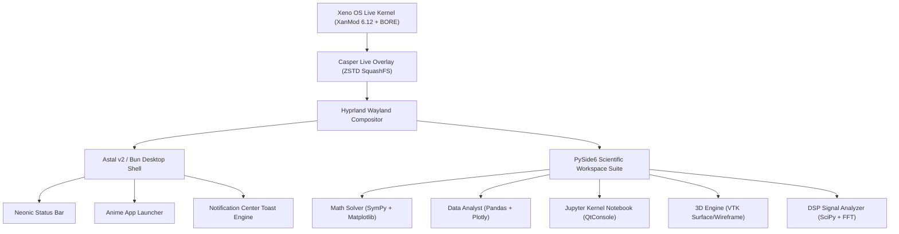

```
 ░█──░█ ░█▀▀▀ ░█▄─░█ ░█▀▀█ ── ░█▀▀█ ░█▀▀▀ 
 ─░█░█─ ░█▀▀▀ ░█░█░█ ░█──█ ── ░█──█ ░▀▀▀█ 
 ░█──░█ ░█▄▄▄ ░█──▀█ ░█▄▄█ ── ░█▄▄█ ░█▄▄█ 
```

> **XENO OS (v2.0 Noble Cyber-Nord)** — Next-Generation Hardware-Agnostic Scientific Linux Distribution featuring custom XanMod BORE Kernel, Hyprland Wayland Compositor, Astal v2 Desktop Shell, and PySide6 Scientific Workspace.

---

## ⚡ Quick Status Badges


---

## 🌌 System Vision & Architecture

**Xeno OS** is engineered as a "Hybrid Powerhouse" Linux distribution combining daily-driver desktop performance, native Windows application isolation via Flatpak/Bottles, kernel-level Wi-Fi frame injection, and a futuristic scientific interface suite.



---

## 💎 Neonic Cyber-Nord Design System

All visual elements strictly enforce the central **Xeno Cyber-Nord Design System** (`desktop/theme.py` & `desktop/shell/theme.ts`). Hardcoded colors or sizing are prohibited.

| Token Name | Hex / Value | Usage Description |
|---|---|---|
| `bg` | `#0c0d12` | Main Deep Slate Background |
| `surface` | `#161821` | Panel Surface Base |
| `surface_2` | `#222533` | Elevated Controls / Hover Cards |
| `accent` | `#88c0d0` | Primary Frost Blue Accent |
| `accent_2` | `#bc13fe` | Secondary Neon Purple Accent |
| `accent_hover` | `#00ffff` | Dynamic Neon Cyan Glow |
| `text` | `#eceff4` | Crisp High-Contrast Body Text |
| `text_dim` | `#a0a8b6` | Secondary Diagnostic Text |

---

## 🔬 Scientific Workspace Suite (`desktop/`)

The PySide6 workspace aggregates multi-threaded scientific panels using thread-safe `QThread` workers:

1. **Math Solver Panel** (`desktop/panels/math_panel.py`): Real-time symbolic calculus (Limits, Derivatives, Integrals, Equation Solving) powered by SymPy & Matplotlib `'Agg'`.
2. **Data Analysis Suite** (`desktop/panels/data_panel.py`): CSV ingestion, multi-column statistics, and interactive Plotly Dark visualization.
3. **Interactive Code Console** (`desktop/panels/code_panel.py`): In-process Jupyter kernel embedded via `qtconsole`.
4. **3D Render Engine** (`desktop/panels/threed_panel.py`): Deferred VTK viewport canvas rendering primitive geometries (Sphere, Cone, Cylinder, Cube) with wireframe/surface controls.
5. **DSP Signal Analyzer** (`desktop/panels/signal_panel.py`): Interactive waveform synthesis (Sine, Square, Sawtooth), Gaussian noise injection, Butterworth lowpass filtering, and FFT spectral breakdown.

---

## 🛡️ VM Software Acceleration & Terminal Fixes (`desktop/env.py`)

When running in Virtual Machines (QEMU/KVM, VirtualBox, VMware) or non-graphical TTY virtual consoles (`Ctrl`+`Alt`+`F3`), Xeno OS automatically handles graphics surface initialization:

> [!IMPORTANT]
> **Automatic VM Fallback**: `desktop/env.py` auto-detects virtualization and forces software rasterization (`LIBGL_ALWAYS_SOFTWARE=1`, `QTWEBENGINE_DISABLE_GPU=1`, `GALLIUM_DRIVER=llvmpipe`, `MESA_LOADER_DRIVER_OVERRIDE=softpipe`), preventing blank window states.

```bash
# Running GUI applications directly from TTY3 targeting active Wayland session (tty1):
WAYLAND_DISPLAY=wayland-0 XDG_RUNTIME_DIR=/run/user/1000 python3 desktop/app.py
```

---

## 🧪 E2E Test Suite (`tests/`)

The test suite validates shell mechanics, diagnostics, notifications, and sandbox security across **72 tests in 4 tiers**:

```bash
# Run test suite in default background Simulation Mode (No display server required)
python3 tests/run_tests.py

# Run test suite in Live Mode against active Wayland compositor
python3 tests/run_tests.py --live
```

---

## 🛠️ Build & ISO Packaging Pipeline

```bash
# Full ISO packaging (chroot, kernel debs, ZSTD SquashFS, GRUB ISO Level 3)
sudo bash scripts/auto-build.sh

# Fix boot display manager conflicts & compositor autostart
sudo bash scripts/fix-boot-display.sh

# Chroot into live rootfs for maintenance
sudo bash scripts/enter-rootfs.sh
```
