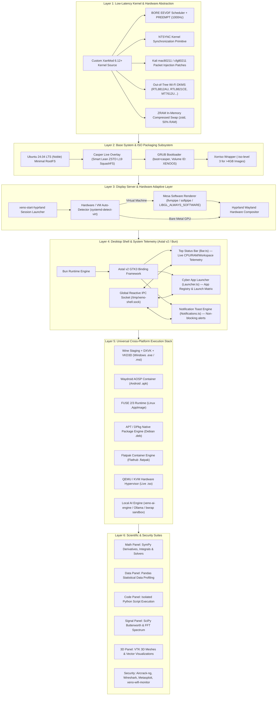

```
 ░█──░█ ░█▀▀▀ ░█▄─░█ ░█▀▀█ ── ░█▀▀█ ░█▀▀▀ 
 ─░█░█─ ░█▀▀▀ ░█░█░█ ░█──█ ── ░█──█ ░▀▀▀█ 
 ░█──░█ ░█▄▄▄ ░█──▀█ ░█▄▄█ ── ░█▄▄█ ░█▄▄█ 
```

# XENO OS — Next-Generation Hybrid Scientific & Security Platform

> **XENO OS (v8.0-BETA Noble Cyber-Nord)** is a bare-metal and VM-agnostic Linux operating system combining a custom low-latency XanMod BORE kernel with Kali packet injection patches, a lightweight TypeScript/Astal v2 desktop shell on Hyprland Wayland, universal cross-platform application execution (`.apk`, `.exe`/`.msi`, `.AppImage`, `.deb`, `.iso`), PySide6 scientific computing panels, high-throughput ZRAM memory compression, and open root sovereignty.

---

## ⚡ System Status Badges


---

## 📋 Complete System Specifications

| Specification Area | Technical Implementation & Parameter |
|---|---|
| **Base Operating System** | Ubuntu 24.04 LTS (Noble Numbat) Clean Debootstrap Base |
| **Kernel & Architecture** | Custom XanMod 6.12+ (x86_64), `CONFIG_PREEMPT_BUILD=y` (Full Real-time Preemption) |
| **Scheduler & Clock Frequency** | BORE (Burst-Oriented Response Enhancer) EEVDF Scheduler @ 1000Hz (`CONFIG_HZ_1000=y`) |
| **Kernel Synchronization** | Fast in-kernel `CONFIG_NTSYNC=y` (Direct Wine/Proton multi-threading synchronization) |
| **Memory Compression (ZRAM)** | `systemd-zram-generator` with **Zstd compression**, dynamic 50% RAM allocation (`ram / 2`) |
| **Virtual Memory Tuning** | `vm.max_map_count=1048576` for high-concurrency VMA handling (Wine/Proton/Scientific workloads) |
| **Display Compositor** | Hyprland Wayland Compositor (with adaptive Mesa `llvmpipe`/`softpipe` fallback for VMs) |
| **Desktop Shell** | TypeScript Astal v2 GTK3 Surface Layer running on the **Bun** runtime engine |
| **Scientific Workspace Suite** | Modular Python / PySide6 GUI panels (SymPy Math, Pandas Data, Code, SciPy Signal, VTK 3D) |
| **Windows App Execution** | Wine Staging 9.x + DXVK + VKD3D-Proton + Bottles + `WINEESYNC=1` + `WINEFSYNC=1` + `i386` multiarch |
| **Android App Execution** | Waydroid AOSP Subsystem sharing Linux kernel binder & Wayland display buffers |
| **Linux Standalone Apps** | Direct FUSE 2/3 runtime (`libfuse2t64`) for zero-install `.AppImage` execution + Flatpak/Flathub |
| **Security & Pentest Stack** | Kali `mac80211` & `cfg80211` packet injection patches + Pinned Kali Rolling repo (`Priority: 100`) |
| **Wireless Adapter Drivers** | Broad in-tree kernel drivers (Intel `iwlwifi`, Atheros `ath9k`/`ath10k`, MediaTek `mt76`, Realtek `rtw88`/`89`, Broadcom) + Realtek injection DKMS installer ([`drivers/install-oot-wifi.sh`](file:///home/xeno/Xeno-os/drivers/install-oot-wifi.sh)) |
| **Local AI Engine & Sandbox** | `xeno-ai-engine` (Ollama/llama.cpp @ `/var/cache/xeno-ai/models`) + Bubblewrap (`bwrap`) isolation |
| **Live Boot & ISO Engine** | Casper Live Overlay (`boot=casper`), ZSTD Level 19 1MB-block SquashFS, GRUB ISO Level 3 (`XENOOS`) |
| **Diagnostic & Auto-Heal** | [`scripts/master-doctor.sh`](file:///home/xeno/Xeno-os/scripts/master-doctor.sh) (8-Tier audit engine with `--fix` self-healing) |
| **Test Verification** | 96 Automated Tests (73 E2E Integration + 23 Adversarial IPC boundary tests) |

---

## 🏛️ Xeno OS Release Tier Classification

Xeno OS is distributed across three distinct edition tiers tailored to different computing paradigms:

```
┌──────────────────────────────────────────────────────────────────────────────────────────────────────────┐
│                                       XENO OS RELEASE TIERS & EDITIONS                                   │
└──────────────────────────────────────────────────────────────────────────────────────────────────────────┘
       │                                           │                                           │
       ▼                                           ▼                                           ▼
 ┌───────────────┐                           ┌───────────────┐                           ┌───────────────┐
 │ ALPHA VERSION │                           │ BETA VERSION  │                           │ OMEGA VERSION │
 └───────┬───────┘                           └───────┬───────┘                           └───────┬───────┘
         │                                           │                                           │
   [ Base Core ]                               [ Desktop GUI ]                             [ Gold Master ]
   - No Graphical GUI                          - Hyprland Wayland                          - Calamares Installer
   - Headless Terminal Mode                    - Astal v2 / Bun Shell                      - Full Offline Drivers
   - XanMod 6.12+ BORE Kernel                  - PySide6 Workspace                         - Local AI Orchestration
   - ZRAM In-Memory Swap                       - Universal App GUI                         - Enterprise Hardening
   - CLI Compatibility Stack                   - Hardware GL Acceleration                  - Production Stable
         │                                           │                                           │
         ▼                                           ▼                                           ▼
  iso/output/ALPHA VERSION/                   iso/output/BETA VERSION/                    iso/output/OMEGA VERSION/
```

### 1. 🔵 ALPHA VERSION — Base OS Core (Headless / Without GUI)
* **Target Output**: `iso/output/ALPHA VERSION/`
* **Architecture**: Core Ubuntu 24.04 LTS (Noble) minimal debootstrap + Custom XanMod 6.12+ BORE EEVDF low-latency kernel + in-memory ZRAM Zstandard compressed swap.
* **Included Stack**:
  - Full Linux CLI networking, WiFi packet injection kernel patches (`mac80211`), and security driver layer.
  - Universal CLI execution runners (`xeno-windows`, `xeno-wifi-monitor`, `xeno-tor-proxy`).
  - Serial console autologin (`ttyS0`) and virtual terminal autologin (`tty1`).
* **Ideal For**: Lightweight server deployments, automated headless CI/CD test harnesses, minimal hypervisors, and terminal-only security audits.

### 2. 🟣 BETA VERSION — Interactive Cyber-Nord Desktop (With GUI)
* **Target Output**: `iso/output/BETA VERSION/`
* **Architecture**: Everything in the Alpha base + full graphical hardware-accelerated Wayland display stack.
* **Included Stack**:
  - **Hyprland Wayland Compositor**: Shader-accelerated tiling window manager with dynamic LLVMpipe software rasterizer fallback for VMs.
  - **Astal v2 / Bun Shell**: Real-time Cyber-Nord top bar, fuzzy application search launcher (`Super+Space`), and interactive notification center.
  - **PySide6 Scientific Suite**: Modular multi-threaded computational workspace (SymPy Calculus, Pandas Analytics, Code IDE, SciPy DSP, VTK 3D).
  - **Universal App GUI**: Seamless windowed execution for Windows (`.exe`/`.msi`), Android (`.apk`), AppImages, and Debian packages.
* **Ideal For**: Interactive daily driving, scientific computation, graphical security simulation, and multimedia/gaming workloads.

### 3. 🟢 OMEGA VERSION — Final Stable Gold Master (Enterprise Edition)
* **Target Output**: `iso/output/OMEGA VERSION/`
* **Architecture**: Everything in the Beta edition + comprehensive offline hardware ecosystem, automated system installer, and local AI orchestration.
* **Included Stack**:
  - **Calamares GUI System Installer**: Automated graphical bare-metal installation to NVMe/SSD/HDD with custom Btrfs/EXT4 subvolume partitioning.
  - **Offline Battery-Included Drivers**: Pre-compiled DKMS binary modules for out-of-tree Realtek/MediaTek adapters, NVIDIA proprietary drivers, and Bluetooth chipsets.
  - **Local AI Agent Engine (`xeno-ai-engine`)**: Offline Ollama/llama.cpp runtime with Bubblewrap container sandboxing.
  - **Production Security Hardening**: Scoped PAM realtime limits, unprivileged user namespaces isolation, and firewall autotuning.
* **Ideal For**: Enterprise workstations, mission-critical scientific laboratories, and zero-compromise penetration testing deployments.

---

## 🧠 ZRAM Architecture & Memory Consumption Specs

Xeno OS is engineered for a lightweight memory footprint and zero physical disk swap latency by leveraging kernel-level in-memory compressed swap (**ZRAM**) alongside aggressive OS de-bloating.

```
                  ┌──────────────────────────────────────────────┐
                  │          TOTAL PHYSICAL RAM (e.g. 8GB)       │
                  └──────────────────────┬───────────────────────┘
                                         │
                 ┌───────────────────────┴───────────────────────┐
                 ▼                                               ▼
   ┌───────────────────────────┐                   ┌───────────────────────────┐
   │    Active System Memory   │                   │    ZRAM0 Compressed Swap  │
   │      (50% = 4000 MB)      │                   │      (50% = 4000 MB)      │
   │                           │                   │  Algorithm: Zstd (~3:1)   │
   │  - XanMod Kernel: ~120MB  │                   │  Effective Storage Space: │
   │  - Hyprland + Shell: ~180MB                   │        ~10 GB - 12 GB     │
   │  - System Services: ~150MB│                   └─────────────┬─────────────┘
   │  - Free/Available: ~3550MB│                                 │
   └───────────────────────────┘                                 ▼
                                                   [ Zero Physical Disk I/O ]
                                                   [ Sub-Microsecond Access ]
                                                   [ Prevents Live USB Hang ]
```

### 1. ZRAM Implementation Details
- **Generator Daemon**: `systemd-zram-generator` configured in `/etc/systemd/zram-generator.conf.d/zram0.conf`.
- **Target Device**: `/dev/zram0` dynamically initialized during boot phase (`system-systemd\x2dzram\x2dsetup.slice`).
- **Allocation Rule**: `zram-size = ram / 2` (exactly 50% of detected physical RAM).
- **Compression Algorithm**: `zstd` (Zstandard). Provides optimal balance of high compression ratio (~2.8:1 to 3.5:1 on text/code/RAM pages) with near-instant decompression throughput (>3GB/s).
- **Diskless Swapping**: Completely eliminates thrashing and freeze-ups when running from slow USB 2.0/3.0 live media or resource-constrained virtual machines.
- **Kernel Memory Overcommit**: Paired with `vm.max_map_count=1048576` and `vm.swappiness=180` to prioritize compressed RAM over cold disk paging.

### 2. Detailed RAM Consumption Profile

| Operational State | RAM Utilization | Primary Active Components |
|---|---|---|
| **Cold Boot Idle (Terminal / Headless)** | **~180 MB – 240 MB** | Systemd, XanMod Kernel, D-Bus, Udev, Serial Getty |
| **Cold Boot Idle (Hyprland + Astal Shell)** | **~450 MB – 680 MB** | Hyprland Wayland, Astal v2 GTK3 Shell, PipeWire, WirePlumber |
| **PySide6 Scientific Workspace (Active)** | **~520 MB – 780 MB** | BasePanel, Workspace Host, Active Background Worker Threads |
| **Scientific Heavy Compute (SymPy / VTK 3D)** | **~850 MB – 1.4 GB** | SymPy Lambdified Matrices, NumPy Array Buffers, VTK 3D Meshes |
| **Windows App Execution (Wine / Bottles)** | **~750 MB – 1.8 GB** | Wine Server, DXVK Shader Pipelines, Audio Pulse/PipeWire bridges |
| **Android Execution (Waydroid AOSP Container)** | **~1.1 GB – 2.1 GB** | Android System Server, SurfaceFlinger, Binder Interface |

### 3. Canonical De-Bloat Engine
To maintain the ~450MB idle footprint, Xeno OS removes heavy Canonical telemetry and background bloat from the Noble base:
- `snapd` & `snap` daemons purged (replaced with native APT and Flatpak/Flathub).
- `cups` print spoolers and `geoclue-2.0` location tracking stripped.
- `apport` and `whoopsie` crash uploaders removed.
- Python bytecode (`__pycache__`, `*.pyc`) and APT archive caches stripped during ISO compression.

---

## 🏛️ Internal System Architecture & Directory Layout



---

## 📁 Repository & Filesystem Map

```
Xeno-os/
├── desktop/                    # Desktop environment, shell, panels, and theme engine
│   ├── env.py                  # VM software rendering environment initializer
│   ├── theme.py                # Python theme tokens (Single Source of Truth)
│   ├── app.py                  # PySide6 desktop suite root launcher
│   ├── workspace.py            # Scientific workspace multi-panel host
│   ├── filemanager.py          # Cyber-Nord file explorer with security checks
│   ├── loginscreen.py          # Session display lock/login manager
│   ├── settings.py             # Desktop system preferences & theme customizer
│   ├── avatar_controller.py    # Interactive desktop assistant interface
│   ├── avatar_viewer.html      # 3D Avatar WebGL viewer template
│   ├── assets/                 # Desktop visual icons and SVG assets
│   ├── themes/                 # Supplemental theme presets and palettes
│   ├── shell/                  # Astal v2 / Bun TypeScript desktop shell
│   │   ├── app.ts              # Astal application entry point
│   │   ├── state.ts            # Reactive IPC client & telemetry store
│   │   ├── Bar.ts              # Status bar with CPU/RAM/clock/workspaces
│   │   ├── Launcher.ts         # Fast fuzzy application grid launcher
│   │   ├── Notifications.ts    # Floating notification toast center
│   │   ├── theme.ts            # TypeScript visual tokens (mirror of theme.py)
│   │   ├── sandbox.sh          # Sandboxed desktop shell launcher
│   │   ├── trigger.py          # Status bar & launcher IPC trigger utility
│   │   └── package.json        # Bun package definition & Astal dependencies
│   └── panels/                 # PySide6 scientific computational panels
│       ├── base_panel.py       # Threaded BasePanel & BaseWorker foundation
│       ├── math_panel.py       # SymPy symbolic calculus & equation solver
│       ├── data_panel.py       # Pandas/NumPy statistical analysis panel
│       ├── code_panel.py       # Live syntax-highlighted code executor
│       ├── signal_panel.py     # SciPy DSP, FFT, and Butterworth filters
│       └── threed_panel.py     # VTK 3D geometry & parametric renderer
├── drivers/                    # Hardware driver packages & setup scripts
│   ├── README.md               # Hardware & wireless driver technical manual
│   └── install-oot-wifi.sh     # Realtek (rtl8812au) out-of-tree DKMS installer
├── iso/                        # ISO build artifacts and output
│   ├── build/casper/           # Live boot filesystem (SquashFS location)
│   ├── output/                 # Generated ISO images (ALPHA, BETA, OMEGA)
│   └── version.txt             # Target build version string (e.g. 8.0-beta)
├── kernel/                     # XanMod kernel sources, patches, and build scripts
│   ├── configs/                # xeno.config.fragment (BORE, NTSYNC, 1000Hz, WLAN)
│   ├── patches/                # 0001 (mac80211), 0002 (cfg80211), 0003 (usb injection)
│   ├── cache/                  # Staged compiled linux-image deb packages
│   ├── build-kernel.sh         # Automated XanMod kernel compilation pipeline
│   └── validate-kernel-deb.sh  # Kernel package verification gate
├── rootfs/                     # Ubuntu 24.04 LTS (Noble) debootstrap root filesystem
├── scripts/                    # Core build, configuration, and diagnostic tools
│   ├── auto-build.sh           # Smart Lean ISO packaging pipeline (ZSTD L19 + Level 3)
│   ├── master-doctor.sh        # Master 8-Tier diagnostic and self-healing doctor
│   ├── fix-boot-display.sh     # Display manager conflict resolution & VM launcher
│   ├── setup-compat-stack.sh   # Windows (Wine/DXVK/Bottles) compatibility installer
│   ├── setup-security-tools.sh # Kali tools, pinned repo, and injection helpers
│   ├── setup-ai.sh             # Ollama local LLM runtime and sandbox setup
│   ├── fix-kernel-rootfs.sh    # Kernel installation into rootfs
│   ├── stage-kernel-debs.sh    # Stages locally compiled kernels into cache/
│   ├── install-astal-chroot.sh # Astal shell and Bun dependencies installer
│   ├── enter-rootfs.sh         # Interactive chroot mount tool
│   └── lib-chroot.sh           # Shared chroot mount/unmount utility library
├── tests/                      # Automated test suite (96 tests)
│   ├── run_tests.py            # Test suite runner (Simulation & Live modes)
│   ├── test_e2e.py             # 73 E2E Integration and UX scenario tests
│   ├── test_adversarial.py     # 23 Adversarial IPC boundary & stress tests
│   ├── simulator.py            # Headless mock display server & IPC simulator
│   └── bin/                    # Test mock runner wrappers
├── .cursorrules                # AI engineer rules & memory log
├── .editorconfig               # Editor code style & whitespace rules
├── AGENTS.md                   # AI developer guidelines & critical path constraints
├── CHANGELOG.md                # System revision history and activity log
├── run-qemu.sh                 # Fast QEMU test runner (--gui or --terminal)
├── xorriso-wrapper.sh          # ISO Level 3 oversized image injection wrapper
└── README.md                   # Master technical manual and architectural spec
```

---

## 🚀 Key Subsystems & Functionality

### 1. Universal Cross-Platform Application Engine

Xeno OS allows running applications across virtually any format seamlessly:

```
                                   ┌────────────────────────────────────────────────────────┐
                                   │           XENO OS UNIVERSAL EXECUTION ENGINE           │
                                   └───────────────────────────┬────────────────────────────┘
                                                               │
            ┌───────────────────┬──────────────────────────────┼──────────────────────────────┬───────────────────┐
            ▼                   ▼                              ▼                              ▼                   ▼
       [.exe / .msi]         [.apk]                       [.AppImage]                       [.deb]             [.iso]
      (Windows Stack)    (Android AOSP)                (FUSE Standalone)                (Native Linux)      (Hypervisor)
            │                   │                              │                              │                   │
      Wine Staging +      Waydroid LXC                   libfuse2 FUSE                   APT / Dpkg Base     Hardware KVM
       DXVK / VKD3D      Kernel Binder                  User-Space Mount                + Pinned Kali Repo    + QEMU Virt
            │                   │                              │                              │                   │
      Direct3D→Vulkan    SurfaceFlinger                  Zero-Install                    Native ELF64        Full Hardware
       NTSYNC Kernel     Wayland Buffers                 Direct Execution                glibc 2.39 Bin      Virtualization
            │                   │                              │                              │                   │
            └───────────────────┴──────────────────────────────┼──────────────────────────────┴───────────────────┘
                                                               │
                                                               ▼
                                    ┌─────────────────────────────────────────────────────┐
                                    │        CUSTOM XANMOD 6.12+ LOW-LATENCY KERNEL       │
                                    │   - BORE EEVDF Scheduler (1000Hz Timer Frequency)   │
                                    │   - CONFIG_NTSYNC & PREEMPT Real-Time Multitasking  │
                                    │   - ZRAM In-Memory Compressed Swap (zstd 50% RAM)   │
                                    │   - Hyprland Wayland Hardware Compositor            │
                                    └─────────────────────────────────────────────────────┘
```

- **Windows Software (`.exe`, `.msi`)**:
  - System Wine Staging + DXVK (Direct3D 9/10/11 -> Vulkan) and VKD3D-Proton (Direct3D 12 -> Vulkan).
  - Preconfigured with `WINEESYNC=1`, `WINEFSYNC=1`, and in-kernel `CONFIG_NTSYNC=y` synchronization.
  - Multiarch `i386` for seamless 32-bit legacy application support.
  - GUI management via **Bottles** and CLI wrapper `/usr/bin/xeno-windows`.
- **Android Applications (`.apk`)**:
  - Waydroid AOSP container integrated directly into the Linux kernel (via Android binder & ashmem).
  - Shares Wayland buffers for near-zero latency touch and windowed app execution.
- **Linux Standalone Binaries (`.AppImage`)**:
  - Built-in `libfuse2t64` / `libfuse.so.2` compatibility layer allowing instant double-click execution without extracting.
- **Native Debian Packages (`.deb`)**:
  - Dual repository support (Ubuntu Noble base + pinned Kali Linux rolling repo).
- **Virtual Machines & Live ISOs (`.iso`)**:
  - Direct hardware-assisted QEMU/KVM hypervisor integration.
- **Local AI Engine (`xeno-ai-engine`)**:
  - Built-in Ollama / llama.cpp runtime hosted at `/var/cache/xeno-ai/models` on `127.0.0.1:11434`.
  - Sandboxed execution wrapper `/usr/bin/xeno-agent-sandbox` utilizing Bubblewrap (`bwrap`).

---

### 2. Scientific & Computational PySide6 Workspace

Subclassed under [`BasePanel`](file:///home/xeno/Xeno-os/desktop/panels/base_panel.py) with asynchronous non-blocking [`BaseWorker`](file:///home/xeno/Xeno-os/desktop/panels/base_panel.py) offloading:

1. **Math Panel ([`math_panel.py`](file:///home/xeno/Xeno-os/desktop/panels/math_panel.py))**:
   - Symbolic calculus powered by **SymPy**: differentiation, integration, limits, and algebraic equation solving.
   - Vectorized function evaluation using **NumPy** (`lambdify`) and interactive **Matplotlib** curve plots.
2. **Data Panel ([`data_panel.py`](file:///home/xeno/Xeno-os/desktop/panels/data_panel.py))**:
   - Statistical profiling powered by **Pandas** & **SciPy**: summary statistics, null analysis, correlation matrices, and distribution histogram plots.
3. **Code Panel ([`code_panel.py`](file:///home/xeno/Xeno-os/desktop/panels/code_panel.py))**:
   - Live Python code editor with syntax highlighting, thread-isolated execution, stdout/stderr capture, and error traceback parsing.
4. **Signal Panel ([`signal_panel.py`](file:///home/xeno/Xeno-os/desktop/panels/signal_panel.py))**:
   - Digital signal processing: Butterworth low-pass/high-pass/band-pass filters, Fast Fourier Transforms (FFT), and time-frequency spectrogram visualization.
5. **3D Panel ([`threed_panel.py`](file:///home/xeno/Xeno-os/desktop/panels/threed_panel.py))**:
   - Hardware-accelerated 3D surface geometry, parametric meshes, and vector field visualization powered by **VTK**.
   - Implements `_lazy_init_vtk()` to eliminate X11/Wayland `BadWindow` crashes on startup.
6. **File Manager ([`filemanager.py`](file:///home/xeno/Xeno-os/desktop/filemanager.py))**:
   - Dual-pane tree explorer with asynchronous previews (capped at 10MB to avoid memory starvation) and rootfs security delete protection.

---

### 3. Offensive Security & Wireless Injection Subsystem

1. **Kernel Packet Injection**:
   - Custom patches in `net/mac80211/tx.c` enable raw IEEE 802.11 frame injection and custom sequence numbering.
   - Patches in `net/wireless/chan.c` permit dynamic channel switching while monitor VIFs are active.
2. **Hardware & Wireless Driver Architecture**:
   - Comprehensive in-tree driver support compiled into the custom XanMod kernel for major chipsets (Intel `iwlwifi`, Atheros `ath9k`/`ath10k`, MediaTek `mt76`, Realtek `rtw88`/`rtw89`, Broadcom `brcmfmac`, Ralink `rt2800usb`, ZyDAS `zd1211rw`).
   - Dedicated out-of-tree DKMS installer ([`drivers/install-oot-wifi.sh`](file:///home/xeno/Xeno-os/drivers/install-oot-wifi.sh)) for Realtek `rtl8812au`/`rtl8821au` USB injection adapters against matching installed kernel headers.
3. **Pinned Kali Repository**:
   - Configured with `Pin-Priority: 100` in `/etc/apt/preferences.d/kali-pinning` to allow selective installation of Kali security tools without overriding the stable Ubuntu Noble base.
4. **Pre-Installed Tools & Utilities**:
   - `aircrack-ng`, `wireshark`, `nmap`, `bettercap`, `msfconsole`, `hydra`, `sqlmap`, `john`, `scapy`, and `tor`.
   - `/usr/bin/xeno-wifi-monitor`: One-shot virtual monitor interface creator and packet injection test utility.
   - `/usr/bin/xeno-tor-proxy`: Transparent TCP/DNS Tor routing helper.

---

### 4. TypeScript Astal v2 Desktop Shell & GUI Development Workflow

Xeno OS features a native TypeScript desktop shell built on **Astal v2** (GTK3) and executed on the high-performance **Bun** runtime engine:

```
┌────────────────────────────────────────────────────────────────────────────────────────┐
│                        XENO OS TYPESCRIPT DESKTOP SHELL (BUN + ASTAL)                  │
├────────────────────────────────────────────────────────────────────────────────────────┤
│  Top Bar (Bar.ts)       → Dynamic Workspaces, Telemetry Gauges (CPU/RAM), System Clock │
│  App Launcher (Launcher.ts) → Cyber-Nord Grid & Fuzzy Search Matrix (Super+Space)      │
│  Notification Center (Notifications.ts) → High-Throughput Toast Dispatch Queue         │
│  IPC & State Engine (state.ts) → Reactive State Store on /tmp/xeno-ipc.sock            │
│  Crash-Proof Launcher (xeno-desktop-shell) → Auto-discovered & launched by Hyprland   │
└────────────────────────────────────────────────────────────────────────────────────────┘
```

#### Developing & Previewing Custom TypeScript GUIs
* **Live VM Preview**: Boot your ISO anytime using `bash run-qemu.sh --gui`. Hyprland boots with software cursor fallback (`no_hardware_cursors = true`) and automatically runs [`/usr/bin/xeno-desktop-shell`](file:///home/xeno/Xeno-os/rootfs/usr/bin/xeno-desktop-shell), rendering your custom TypeScript GUI instantly without crashes.
* **Local Sandbox Preview**: Test and hot-reload your TypeScript shell without rebooting:
  ```bash
  # Launch the shell in local developer sandbox
  bash desktop/shell/sandbox.sh
  # Or run directly via Bun
  cd desktop/shell && bun run app.ts
  ```
* **Zero-Crash Aquamarine Display Pipeline**:
  - `cursor { no_hardware_cursors = true }` eliminates Aquamarine hardware DRM cursor allocation faults.
  - `AQ_FORCE_LINEAR_BLIT=1` and `AQ_NO_MODIFIERS=1` guarantee rock-solid linear buffer rendering in VMs (QEMU, Hyper-V, VMware, VirtualBox) and bare-metal GPUs.
  - Global TypeScript error boundaries (`uncaughtException` & `unhandledRejection`) safely catch runtime UI errors, preventing compositor drops during active GUI development.
* **Retained Hyprland Core Desktop Elements**:
  - Full tiling window management with key shortcuts (`Super+Return` for Kitty terminal, `Super+Space` for application launcher, `Super+Q` to close, `Super+1..5` for workspace switching, `Print` for screenshot capture).

---

### 5. Cyber-Nord Design Tokens (Single Source of Truth)

All visual properties across both Python PySide6 panels and TypeScript Astal shell strictly adhere to central theme tokens ([`desktop/theme.py`](file:///home/xeno/Xeno-os/desktop/theme.py) and [`desktop/shell/theme.ts`](file:///home/xeno/Xeno-os/desktop/shell/theme.ts)):

```
┌────────────────────────────────────────────────────────────────────────┐
│                        CYBER-NORD COLOR TOKENS                         │
├────────────────────────────────┬───────────────────────────────────────┤
│ Background  (Deep Slate/Black) │ #0c0d12                             │
│ Surface     (Deep Slate)       │ #161821                             │
│ Surface 2   (Raised Elements)  │ #222533                             │
│ Border      (Subtle Dividers)  │ #2f3448                             │
│ Accent 1    (Frost Blue)       │ #88c0d0                             │
│ Accent 2    (Neon Purple)      │ #bc13fe                             │
│ Accent Hover(Neon Cyan)        │ #00ffff                             │
│ Text        (Crisp Snow White) │ #eceff4                             │
│ Text Dim    (Muted Blue-Gray)  │ #a0a8b6                             │
│ Success / Warning / Error      │ #a3be8c / #ebcb8b / #bf616a    │
├────────────────────────────────┼───────────────────────────────────────┤
│ Primary Typography             │ Inter (UI, Body, Labels)              │
│ Monospace Typography           │ JetBrains Mono (Code, Logs, Clocks)   │
└────────────────────────────────┴───────────────────────────────────────┘
```

---

## 🛠️ Management, Diagnostics & Auto-Healing

### 1. Master Doctor (8-Tier System Diagnostic)
```bash
# Run comprehensive 8-tier audit across host, rootfs, kernel, shell, and tests
bash scripts/master-doctor.sh

# Run Master Doctor in self-healing mode (auto-repairs missing configs/links)
sudo bash scripts/master-doctor.sh --fix
```

### 2. ISO Packaging Pipeline (Smart Lean Engine)
```bash
# Run full automated ISO packaging pipeline (ZSTD L19 + Level 3 GRUB)
sudo bash scripts/auto-build.sh
```

### 3. QEMU Virtual Machine Testing
```bash
# Launch built ISO in graphical Wayland mode
bash run-qemu.sh --gui

# Launch built ISO in headless serial console mode (ttyS0 autologin)
bash run-qemu.sh --terminal
```

### 4. Automated Test Suite (96 Tests)
```bash
# Run simulation mode (73 E2E Integration + 23 Adversarial IPC tests)
python3 tests/run_tests.py && python3 -m unittest tests/test_adversarial.py

# Run live mode (interacts with active Wayland/X11 session)
python3 tests/run_tests.py --live
```

---

## 💻 Hardware Requirements

| Resource | Minimum (Simulation / VM) | Recommended (Bare Metal) |
|---|---|---|
| **CPU** | 64-bit x86_64 Dual Core (2.0 GHz) | 64-bit x86_64 Quad Core+ with AVX2 & VT-x/AMD-V |
| **RAM** | 2.0 GB (with ZRAM enabled) | 8.0 GB+ (provides ~16GB+ effective memory via Zstd) |
| **Storage** | 15.0 GB free disk space (for build) | 32.0 GB+ NVMe / SSD |
| **GPU** | Mesa Software Rasterizer (`llvmpipe`) | Intel Iris / AMD Radeon / NVIDIA (Vulkan 1.3+) |
| **Wi-Fi** | Any standard IEEE 802.11 adapter | Atheros AR9271 / Realtek RTL8812AU / MediaTek MT7612U (for injection) |

---

## 📜 Authorship & License

- **Architect & Developer**: Harsh Thakur (**Xeno — The Reaper of Eternal Graveyard**)
- **Platform Foundation**: Ubuntu Linux 24.04 LTS (Noble Numbat)
- **Kernel Architecture**: XanMod Linux with BORE Scheduler & Kali Injection Extensions
- **Desktop Runtime**: Hyprland Wayland Compositor & Astal v2 (Bun)
- **License**: Open Root Sovereignty & GNU General Public License v3.0
