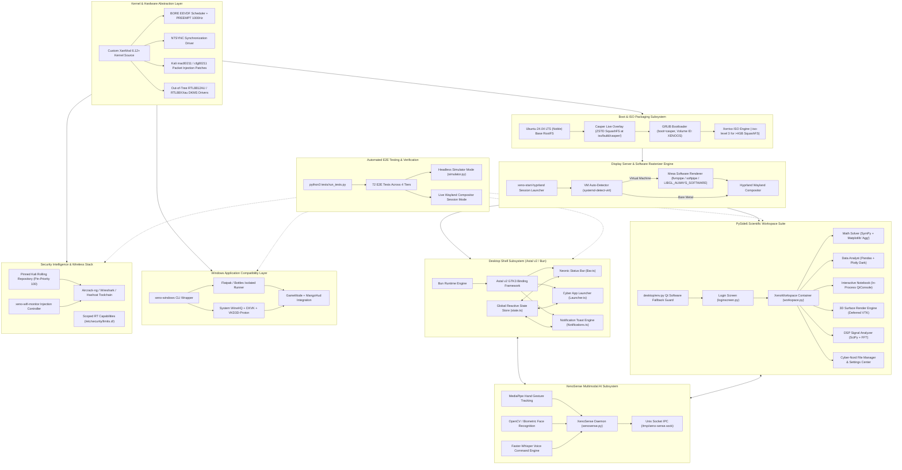

```
 ░█──░█ ░█▀▀▀ ░█▄─░█ ░█▀▀█ ── ░█▀▀█ ░█▀▀▀ 
 ─░█░█─ ░█▀▀▀ ░█░█░█ ░█──█ ── ░█──█ ░▀▀▀█ 
 ░█──░█ ░█▄▄▄ ░█──▀█ ░█▄▄█ ── ░█▄▄█ ░█▄▄█ 
```

> **XENO OS (v2.0 Noble Cyber-Nord)** — Next-Generation Hardware-Agnostic Scientific & Security Linux Distribution featuring custom XanMod BORE Kernel, Hyprland Wayland Compositor, Astal v2 Desktop Shell, PySide6 Scientific Workspace, Kali Packet Injection Engine, and XenoSense Multimodal AI Subsystem.

---

## ⚡ System Status Badges


---

## 🌌 System Vision & Architecture

**Xeno OS** is engineered as a zero-compromise, hybrid Linux distribution designed for high-performance daily desktop usage, symbolic and numerical scientific computing, hardware-agnostic virtual machine deployments, native low-latency Windows application translation, and kernel-level wireless penetration testing.

### Core Architectural Pillars
1. **Low-Latency Kernel Engine**: Built on a custom XanMod 6.12+ Linux kernel featuring the BORE (Burst-Oriented Response Enhancer) EEVDF CPU scheduler, full preemption (`CONFIG_PREEMPT_BUILD=y`), 1000Hz timer frequency, and kernel-level `CONFIG_NTSYNC` synchronization primitives for ultra-smooth gaming and desktop interactivity.
2. **Kernel Wireless Injection Stack**: Native patch series for `mac80211` and `cfg80211` allowing arbitrary frame injection, monitor mode channel switching under active VIFs, and out-of-tree Realtek DKMS wireless driver integration.
3. **Dual GUI Architecture**:
   - **Desktop Shell**: High-speed TypeScript shell built on the Bun runtime using Astal v2 (`astal/gtk3`) for reactive panel bars, app launchers, and system notification toasts.
   - **Scientific Workspace**: Modular PySide6 desktop suite integrating thread-isolated panels for symbolic mathematics, numerical data analysis, interactive Jupyter code execution, VTK 3D graphics rendering, and SciPy DSP signal processing.
4. **Hardware Agnosticism & VM Rasterization**: Native hardware acceleration via Intel/AMD/NVIDIA Mesa graphics drivers with automatic runtime hypervisor detection (`systemd-detect-virt`) that seamlessly degrades to high-throughput software rasterization (`llvmpipe` / `softpipe`) inside VirtualBox, Hyper-V, QEMU/KVM, or standalone TTY consoles.
5. **Multimodal AI & Socket Subsystem (XenoSense)**: Low-overhead background perceptual engine projecting MediaPipe hand tracking gestures, OpenCV biometric face recognition, and Faster-Whisper offline voice commands onto a non-blocking Unix domain socket (`/tmp/xeno-sense.sock`).
6. **Isolated Windows Compatibility**: Hybrid execution pipeline combining system WineHQ, DXVK, VKD3D-Proton, GameMode, MangoHud, and Flatpak-isolated Bottles runners.

---

## 📊 Complete Subsystem Architecture Map



---

## 🔬 Deep-Dive Subsystem Specifications

### 1. Custom XanMod Kernel & Wireless Packet Injection (`kernel/`)
- **Kernel Baseline**: XanMod 6.12+ tree built using Ubuntu production baseline configuration flags combined with `kernel/configs/xeno.config.fragment`.
- **Latency & Performance Flags**:
  - `CONFIG_PREEMPT_BUILD=y`: Full preemption for real-time responsiveness.
  - `CONFIG_HZ_1000=y`: 1000Hz scheduler clock tick for low micro-stuttering.
  - `CONFIG_NTSYNC=y`: Fast in-kernel synchronization primitive for Wine/Proton.
- **Wireless Packet Injection Patches**:
  - `0001-mac80211-injection-sequence-and-qos.patch`: Enables arbitrary frame injection and sequence number overriding in `net/mac80211/tx.c`.
  - `0002-cfg80211-allow-monitor-channel-change.patch`: Permits channel switching on monitor interfaces while virtual interfaces (VIFs) are active in `net/wireless/chan.c`.
  - `0003-legacy-usb-wifi-injection-helpers.patch`: Injection support for legacy USB Wi-Fi chipsets (`zd1211rw`, `rtl8187`).
- **Out-of-Tree Drivers**: DKMS builder for Realtek high-power wireless chipsets (`drivers/install-oot-wifi.sh` for `rtl8812au` / `rtl88XXau`).

### 2. ISO Packaging & Casper Live Overlay (`iso/` & `scripts/`)
- **RootFS Distribution**: Ubuntu 24.04 LTS (Noble Numbat) base filesystem customized with Casper live boot hooks.
- **SquashFS Path Enforcement**:
  > [!CRITICAL]
  > SquashFS image MUST reside strictly at `iso/build/casper/filesystem.squashfs` (NEVER `iso/build/live/`). Using `live/` triggers immediate Linux kernel panic during boot.
- **ISO Level 3 Oversized Image Support**: Because scientific dependencies (VTK, PySide6, Matplotlib, SciPy, Jupyter, Flatpak runtime) cause `filesystem.squashfs` to exceed 4GB, `xorriso` invocation requires `-iso-level 3` to prevent ISO creation overflow.
- **GRUB Parameters**: GRUB Volume ID must be $\le 8$ uppercase alphanumeric characters (`XENOOS`). Boot command specifies:
  ```grub
  linux /casper/vmlinuz boot=casper quiet splash hostname=xeno-os ---
  initrd /casper/initrd
  ```
- **Primary Packaging Pipeline**: `sudo bash scripts/auto-build.sh` validates kernel DEB artifacts, updates rootfs, builds ZSTD compressed SquashFS, and packs bootable ISO image into `iso/output/`.

### 3. Graphics Compositor & VM Software Fallback Engine (`desktop/env.py`)
- **Compositor**: Hyprland Wayland compositor with custom Cyber-Nord window rules and bindings (`rootfs/home/xeno/.config/hypr/hyprland.conf`).
- **VM Hardware Detection**: Launcher script `/usr/bin/xeno-start-hyprland` executes `systemd-detect-virt`. If running inside Hyper-V, VirtualBox, VMware, or QEMU without Vulkan drivers, it automatically sets:
  ```bash
  export WLR_RENDERER_ALLOW_SOFTWARE=1
  export WLR_NO_HARDWARE_CURSORS=1
  export LIBGL_ALWAYS_SOFTWARE=true
  export GALLIUM_DRIVER=llvmpipe
  export __GLX_VENDOR_LIBRARY_NAME=mesa
  export MESA_LOADER_DRIVER_OVERRIDE=softpipe
  export QTWEBENGINE_DISABLE_GPU=1
  ```
- **Python Environment Initialization**: Entry points import `from desktop.env import init_qt_environment; init_qt_environment()` to prevent blank surface rendering on non-accelerated TTY consoles or VM instances.
- **VM Performance Guardrails**: Enforces solid background colors with pre-baked alpha hex strings ($\ge 0.9$ opacity), disables dynamic CSS blur filters (`backdrop-filter`), omits drop shadows, and uses fixed pixel dimensions to minimize CPU software rasterization overhead.

### 4. Desktop Shell Suite (TypeScript / Astal v2 / Bun) (`desktop/shell/`)
- **Runtime**: Powered by Bun runtime engine for instant execution.
- **Framework**: Imports `astal/gtk3` and `astal` (Astal v2).
- **Core Components**:
  - `Bar.ts`: Top-level status bar with system resource gauges (CPU, RAM, Network, Battery, Clock) optimized for minimal polling overhead.
  - `Launcher.ts`: Application launcher menu.
  - `Notifications.ts`: Toast notification daemon for desktop alerts.
  - `state.ts`: Centralized reactive state store.
  - `trigger.py`: Inter-process trigger helper (`xeno-shell-trigger`).

### 5. Scientific Workspace Suite (PySide6) (`desktop/`)
Every scientific panel inherits from `desktop.panels.base_panel.BasePanel` or `MatplotlibPanel`. Heavy numerical calculations execute off-thread inside `BaseWorker` (`QObject`) attached to a `QThread`, communicating with the UI strictly via `Qt.QueuedConnection` signals to prevent main thread blocking or SIGSEGV memory faults.

```
desktop/
├── app.py             # Top-level authentication stack & view swapper
├── env.py             # Software rendering environment setup
├── theme.py           # Python single-source-of-truth visual design tokens
├── loginscreen.py     # Decryption prompt & authentication UI
├── workspace.py       # Multi-panel tabbed scientific container
├── settings.py        # System configuration & desktop controls
├── filemanager.py     # Cyber-Nord file explorer
└── panels/            # Scientific calculation modules
    ├── base_panel.py  # Thread-safe base panel & worker architecture
    ├── math_panel.py  # Symbolic SymPy solver + Matplotlib calculus rendering
    ├── data_panel.py  # High-throughput Pandas CSV analyzer + Plotly Dark engine
    ├── code_panel.py  # In-process Jupyter kernel console (qtconsole)
    ├── threed_panel.py# Deferred VTK 3D primitive canvas (Sphere, Cone, etc.)
    └── signal_panel.py# SciPy FFT spectral analyzer & waveform generator
```

- **Deferred VTK Loading**: To prevent X11 `BadWindow` crashes on startup when hidden inside `QStackedWidget`, `threed_panel.py` defers VTK viewport initialization to method scope (`_lazy_init_vtk()`).
- **Matplotlib Backend Guard**: All panel files enforce `matplotlib.use('Agg')` prior to any secondary matplotlib sub-imports.

### 6. Windows Application Isolation & Compatibility Stack (`scripts/setup-compat-stack.sh`)
- **Isolated Runner**: Flatpak-conconfined Bottles runner (`com.usebottles.bottles`) preventing unvetted Windows binaries from reading user home directories.
- **Native System Wine**: WineHQ stack with 32-bit (i386) multi-arch libraries, Winetricks, GameMode, and MangoHud diagnostics.
- **Graphics Translation**: DXVK (Direct3D 9/10/11 to Vulkan) and VKD3D-Proton (Direct3D 12 to Vulkan).
- **Helper Utilities**: CLI launcher `/usr/bin/xeno-windows` and system environment configuration (`/etc/profile.d/xeno-wine.sh`) enabling `WINEESYNC=1`, `WINEFSYNC=1`, and `WINE_VK_USE_WSI=1`.

### 7. Security Intelligence & Wireless Suite (`scripts/setup-security-tools.sh`)
- **Pinned Kali Repository**: Adds `kali-rolling` repository with explicit Pin-Priority 100 (`/etc/apt/preferences.d/kali-pinning`) to allow explicit opt-in package installation (`apt-get install -t kali-rolling <pkg>`) without breaking baseline Ubuntu system packages.
- **Wireless Controller**: `/usr/bin/xeno-wifi-monitor` helper script for rapid switching of wireless interfaces between Managed and Monitor modes, channel hopping, and packet capture.
- **Pre-installed Security Suite**: `aircrack-ng`, `wifite`, `airgeddon`, `hashcat`, `wireshark`, `tshark`, `nmap`, `sqlmap`, `hydra`, `john`, `tor`, `nftables`, `impacket`, `scapy`.
- **Scoped Real-Time Capabilities**: Scopes RT scheduling permissions in `/etc/security/limits.d/99-hyprland.conf` to `@hyprland` and `xeno` groups rather than unconstrained global wildcards (`*`).

### 8. XenoSense Multimodal AI & Perceptual Subsystem (`desktop/xenosense/`)
- **IPC Architecture**: Non-blocking background daemon (`xenosense.py`) streaming JSON telemetry packets over Unix domain socket `/tmp/xeno-sense.sock`.
- **Gesture Recognition Engine**: MediaPipe hand-tracking pipeline capturing gestures (`SWIPE_LEFT`, `SWIPE_RIGHT`, `SWIPE_UP`, `SWIPE_DOWN`, `FIST`, `OPEN_PALM`, `PEACE`, `PINCH_OPEN`, `PINCH_CLOSE`).
- **Biometric Presence Engine**: OpenCV + `face-recognition` tracking user presence (`face_detected`, `face_absent`).
- **Offline Voice Engine**: Local `Faster-Whisper` STT model processing spoken commands (e.g. *"open math"*).

---

## 💎 Neonic Cyber-Nord Design System

All visual components strictly consume the central design tokens defined in `desktop/theme.py` (Python `XenoTheme`) and mirrored in `desktop/shell/theme.ts` (TypeScript). Hardcoded color literals, font names, or spacing values inside individual UI files are strictly prohibited.

| Token Identifier | Hex / Value | Category | Usage & Description |
|---|---|---|---|
| `bg` | `#0c0d12` | Color | Main Deep Slate Background Base |
| `surface` | `#161821` | Color | Panel Surface Base Container |
| `surface_2` | `#222533` | Color | Elevated Controls & Card Hover States |
| `border` | `#2e3440` | Color | Subtle Component Dividers & Borders |
| `border_glow` | `#88c0d044` | Color | Accent Border Glow (Baked Opacity) |
| `accent` | `#88c0d0` | Color | Primary Frost Blue Accent |
| `accent_2` | `#bc13fe` | Color | Secondary Neon Purple Accent |
| `accent_hover` | `#00ffff` | Color | Interactive Dynamic Neon Cyan Glow |
| `text` | `#eceff4` | Color | High-Contrast Primary Body Text |
| `text_dim` | `#a0a8b6` | Color | Secondary Diagnostic Labels & Metadata |
| `text_muted` | `#4c566a` | Color | Disabled Inputs & Inactive Hints |
| `success` | `#a3be8c` | Color | Positive Status & Diagnostic Pass |
| `warning` | `#ebcb8b` | Color | Warning Alerts & Cautionary Badges |
| `error` | `#bf616a` | Color | Failure Alerts & Security Warnings |
| `font_primary` | `Sans-Serif` | Typography | Standard UI Body & Heading Font |
| `font_mono` | `Monospace` | Typography | Code Notebook & Terminal Font |
| `size_xs` / `size_sm` | `10px` / `12px` | Typography | Timestamps, Badges, Secondary Hints |
| `size_base` / `size_md`| `14px` / `16px` | Typography | Regular Labels, Inputs, Section Titles |
| `size_lg` / `size_xl` | `18px` / `24px` | Typography | Panel Headers, Workspace Titles |
| `size_2xl` / `size_3xl`| `32px` / `48px` | Typography | Status Clocks, Login Lockscreen Display |
| `radius_sm` / `md` / `lg`| `4px` / `8px` / `16px` | Geometry | Component Corner Rounding |
| `panel_padding` | `16px` | Geometry | Standard Interior Panel Margin |

---

## 🧪 E2E Test Suite & Verification Framework (`tests/`)

The test suite validates shell mechanics, panel calculations, system diagnostics, notification broadcasts, and security sandbox policies across **72 tests organized into 4 tiers**:

```bash
# Execute test suite in default background Simulation Mode (No display server required)
python3 tests/run_tests.py

# Execute test suite in Live Mode against active Wayland compositor session
python3 tests/run_tests.py --live
```

### Test Suite Structure
- **Tier 1: Feature Coverage**: Validates individual panel calculation logic (SymPy derivative evaluation, Pandas data ingestion, SciPy FFT transform output, VTK primitive creation).
- **Tier 2: Boundaries & Stress**: Evaluates edge-case mathematical inputs, matrix overflow boundaries, invalid CSV files, and multi-thread rapid worker invocations.
- **Tier 3: Integration Sync**: Verifies IPC notification triggers (`trigger.py`), XenoSense socket packet parsing, shell state synchronization, and environment variable propagation.
- **Tier 4: Real-World Flows & Theme Audits**: End-to-end user navigation simulation from login screen to workspace switching, accompanied by static design token compliance audits across all GUI source files.

---

## 🛠️ Build, Deployment & Maintenance Commands

### 1. ISO Packaging Pipeline
```bash
# Full ISO build pipeline (fetches kernel debs, updates rootfs, builds ZSTD squashfs, generates GRUB ISO Level 3)
sudo bash scripts/auto-build.sh

# Repair display manager autostart, GDM conflicts, and install xeno-start-hyprland launcher
sudo bash scripts/fix-boot-display.sh

# Interactive chroot maintenance shell into rootfs
sudo bash scripts/enter-rootfs.sh
```

### 2. Standalone Application Testing
```bash
# Launch full desktop workspace (authentication -> workspace)
python3 desktop/app.py

# Launch individual PySide6 panels standalone
python3 desktop/panels/math_panel.py
python3 desktop/panels/data_panel.py
python3 desktop/panels/code_panel.py
python3 desktop/panels/threed_panel.py
python3 desktop/panels/signal_panel.py

# Execute desktop shell bar (Bun runtime)
cd desktop/shell && bun run app.ts
```

### 3. Kernel Compilation & Patching Pipeline
```bash
# Compile custom XanMod kernel DEB packages with Kali patches & BORE scheduler
bash kernel/build-kernel.sh

# Validate built kernel DEB package configuration flags
bash kernel/validate-kernel-deb.sh
```

---

## 📁 Repository Directory Map

```
Xeno-os/
├── desktop/                # PySide6 panels + TypeScript Astal shell + theme tokens + env.py
│   ├── app.py              # Main desktop application entry point
│   ├── env.py              # Virtual machine software graphics fallback guard
│   ├── theme.py            # Central Python visual theme tokens (Single Source of Truth)
│   ├── loginscreen.py      # Decryption login screen widget
│   ├── workspace.py        # Scientific panel tabbed workspace container
│   ├── settings.py         # System settings and desktop customization panel
│   ├── filemanager.py      # Cyber-Nord file browser interface
│   ├── panels/             # Scientific calculation panels (BasePanel, Math, Data, Code, 3D, Signal)
│   ├── shell/              # Astal v2 / Bun TypeScript desktop bar, launcher, notifications
│   └── xenosense/          # Multimodal gesture, face, voice AI socket daemon
├── drivers/                # Out-of-tree Wi-Fi driver packages & DKMS setup scripts
├── iso/                    # ISO build directory (build/casper/, output/Xeno-OS-Noble-v2.0.iso)
├── kernel/                 # XanMod kernel build scripts, patches (0001, 0002, 0003), fragments
├── rootfs/                 # Base Ubuntu 24.04 LTS chroot filesystem artifact
├── scripts/                # Packaging, chroot, feature setup, and boot-fix shell utilities
├── tests/                  # E2E test suite (run_tests.py, simulator.py, test_e2e.py, test_adversarial.py)
├── .cursorrules            # Core engineering guidelines & revision logs
├── AGENTS.md               # AI Agent operating constraints & sitemap
├── CHANGELOG.md            # System revision history and session briefings
└── README.md               # Complete Xeno OS system architecture & user manual
```

---

## 📄 License & Credits

Built with ❤️ by the **Xeno-The Reaper of Eternal Graveyard**. Powered by Ubuntu Linux, XanMod Kernel, Hyprland Wayland Compositor, Astal v2, PySide6, SymPy, Pandas, Plotly, SciPy, VTK, and MediaPipe.
